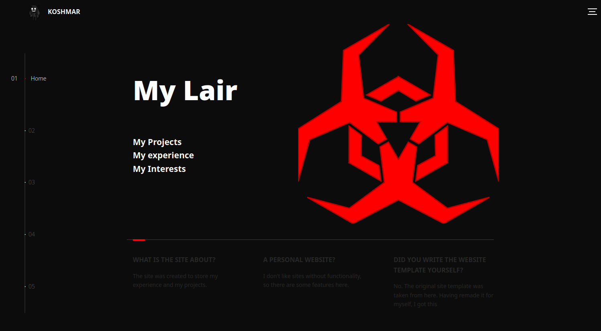
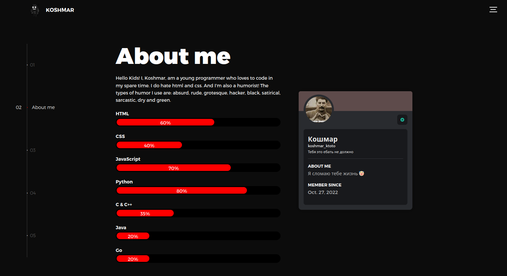
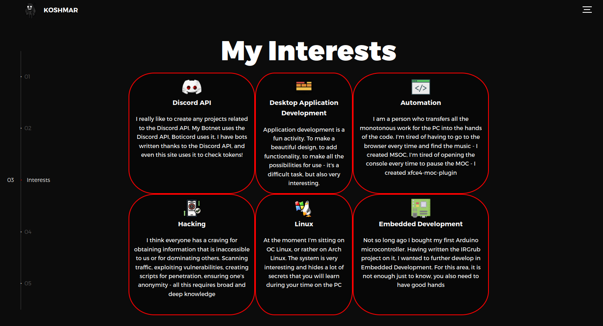
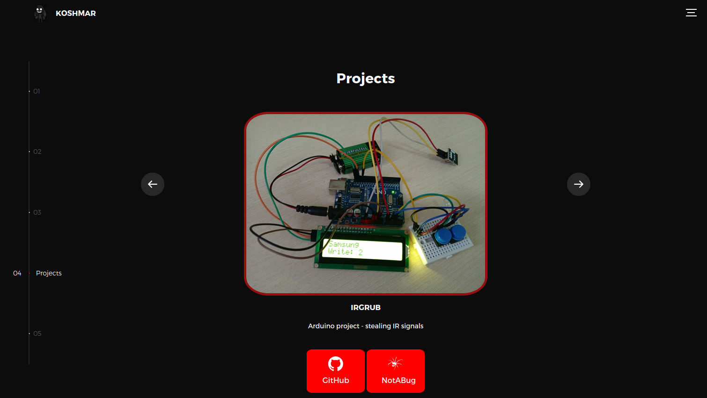
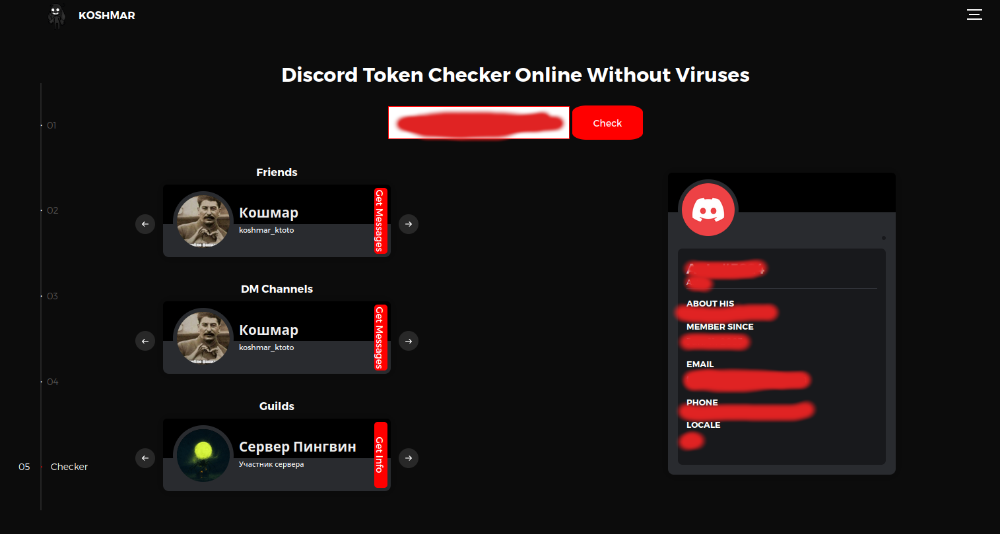

# KoshmarWebSite
Это исходный код моего персонального сайта с небольшим API. На сайте рассказывается обо мне, как о программисте, и моих интересах, проектов и т д<br>
Так же на сайте можно получить информацию об аккаунте Dscord по его токену

# Картинки






# Настройка сайта
Я специально сделал сайт так, чтобы его код могли использовать для своего сайта. Вам придется настроить для себя `css, js, html` файлы. А так же нужно создать `.env` файл:

    SELF_USER_ID=<user-id>
    TOKEN=<another-token>
    LOGIN=<login>
    PASSWORD=<password>

**TOKEN** - Токен Discord пользователя, который будет выполнять запросы к Discord API для получения информации об пользователях (включая ID которого будет указан в **SELF_USER_ID**)<br><br>

**SELF_USER_ID** - ID Discord пользователя, информация которого будет отображаться в `About me`. Важно, чтобы данный пользователь был в друзьях у пользователя, чей токен будет указан в **TOKEN**<br><br>

**LOGIN** - логин, который будет использоваться для управления проектами `/api/admin/project`, отображающиеся в `Projects`<br><br>

**PASSWORD** - пароль к логину<br><br>

Далее сгенерируйте po файлы для перевода сайта на русский и немецкий

	./generate-pot-file.sh
    ./compile-po-files.sh

# API
    /api/get/self, GET
    /api/get/token, POST
    /api/admin/project, GET POST PATCH DELETE

### /api/get/self
**метод GET** - получает информацию об пользователе, ID которого указан в  файле `.env` **SELF_USER_ID**, в виде json 

### **Response**
```json
{'badges': [{'description': 'Старое имя: ****',
             'icon': '6de6d34650760ba5551a79732e98ed60',
             'icon_url': 'https://cdn.discordapp.com/badge-icons/6de6d34650760ba5551a79732e98ed60.png',
             'id': 'legacy_username'}],
 'connected_accounts': [],
 'guild_badges': [],
 'legacy_username': '',
 'mutual_guilds': [],
 'premium_guild_since': None,
 'premium_since': None,
 'premium_type': None,
 'profile_themes_experiment_bucket': -1,
 'user': {'accent_color': 6179659,
          'avatar': '',
          'avatar_decoration': None,
          'avatar_url': '',
          'banner': None,
          'banner_color': '#5e4b4b',
          'bio': '',
          'creation_date': '',
          'discriminator': '0',
          'flags': 0,
          'global_name': '',
          'id': '',
          'public_flags': 0,
          'username': ''},
 'user_profile': {'accent_color': 6179659,
                  'bio': '',
                  'pronouns': ''}}
```

### Example in Python
```py
import requests as req

resp = req.get("<url>/api/get/self")

print(resp.json())
```


### /api/get/token
**метод POST** - получает информацию об пользователе, ID которого указан в  файле `.env` **SELF_USER_ID**, в виде json 

### **Data Params**
    Name    Type    Description
    token   string  Discord user token


### **Response**
```json
{'badges': [],
 'connected_accounts': [],
 'dm-channels': [{'flags': 0,
                  'id': '',
                  'last_message_id': '',
                  'recipients': [{'avatar': 'a18ef36b6568b6824cdf9440051ac6da',
                                  'avatar_decoration': None,
                                  'discriminator': '0',
                                  'global_name': '',
                                  'id': '',
                                  'public_flags': 0,
                                  'username': ''}],
                  'type': 1}],
 'email': '',
 'friends': [{'id': '',
              'nickname': None,
              'since': '',
              'type': 1,
              'user': {'avatar': '',
                       'avatar_decoration': None,
                       'discriminator': '0',
                       'global_name': '',
                       'id': '',
                       'public_flags': 0,
                       'username': ''}}],
 'guild_badges': [],
 'guilds': [{'features': [],
             'icon': '',
             'id': '',
             'name': 'Сервер Пингвин',
             'owner': False,
             'permissions': 2147483647,
             'permissions_new': '140737488355327'},
            {'features': [],
             'icon': None,
             'id': '',
             'name': 'Сервер Auto',
             'owner': True,
             'permissions': 2147483647,
             'permissions_new': '140737488355327'}],
 'legacy_username': None,
 'locale': '',
 'mutual_guilds': [{'id': '', 'nick': None},
                   {'id': '', 'nick': None}],
 'phone': None,
 'premium_guild_since': None,
 'premium_since': None,
 'premium_type': None,
 'profile_themes_experiment_bucket': -1,
 'user': {'accent_color': None,
          'avatar': None,
          'avatar_decoration': None,
          'avatar_url': '',
          'banner': None,
          'banner_color': 'black',
          'bio': '',
          'creation_date': '',
          'discriminator': '',
          'flags': 0,
          'global_name': None,
          'id': '',
          'public_flags': 0,
          'username': ''},
 'user_profile': {'accent_color': None, 'bio': '', 'pronouns': ''}}
```

### Example in Python
```py
import requests as req

resp = req.post("<url>/api/get/token", data={
        "token": "<user-token>"
})

print(resp.json())
```

### /api/admin/project
**метод GET** - получает проект по ID ввиде json
### **JSON Params**
    Name        Type    Description
    login       string  Login admin
    password    string  Password for login
    project_id  int     Project ID

### **Response**
```json
{'description': 'Arduino project - stealing IR signals',
 'description-translations': {'de': 'Arduino-Projekt - IR-Signale stehlen',
                              'ru': 'Проект Arduino - кража ИК-сигналов'},
 'icon': 'img/ir-grub.jpg',
 'id': 1,
 'title': 'IRGrub',
 'urls': {'github': 'https://github.com/KtotoNekt/IRGrub',
          'notabug': 'https://notabug.org/Ktoto/IRGrub'}}
```

### Example in Python
```py
import requests as req

resp = req.get("<url>/api/admin/project", json={
    "login": "<login>",
    "password": "<password>",
    "project_id": <project_id>
})

print(resp.json())
```

**метод POST** - добавляет новый проект. Возвращает новый проект в виде json(ответ такого же формата, как и при `GET` запросе)

### **JSON Params**
    Name        Type            Description
    login       string          Login admin
    password    string          Password for login
    project     ProjectObject   Information of project


### **Project Object**
    Name                        Type            Description
    title                       string          Title project
    description                 string          Description project
    description-translations    TransltObject   Translate description
    icon                        IconObject      Information of icon
    urls                        UrlsObject      Links of project

### **TransltObject**
    Name                Type        Description
    <code-lang:string>  string      Translated description of the project into the specified language


### **IconObject**
    Name        Type        Description
    filename    string      Name file
    data        b64code     File data encode b64code

### **UrlsObject**
    Name       Type       Description
    notabug    string     NotABug link
    github     string     GitHub link

### Example in Python
```py
import requests as req
import base64

with open("/path/to/image/file", "rb") as fr:
    resp = req.post("<url>/api/admin/project", json={
        "login": "<login>",
        "password": "<password>",
        "project": {
            "title": "Yuka",
            'description': 'Discord crash bot with more functionality',
            'description-translations': {
                'de': 'Discord-Crash-Bot mit mehr Funktionalität', 
                'ru': 'Краш-бот Discord с большей функциональностью'
            },
            "icon": {
                "filename": "yuka.jpg",
                "data": base64.b64encode(fr.read()).decode()
            }, 
            'urls': {
                'github': 'https://github.com/KtotoNekt/Yuka', 
                'notabug': 'https://notabug.org/Ktoto/Yuka'
            }
        }
    })

    print(resp.json())
```


**метод PATCH** - изменяет параметры существующего проекта. Возвращает измененный проект в виде json(ответ такого же формата, как и при `GET` запросе)

### **JSON Params**
    Name          Type            Description
    login         string          Login admin
    password      string          Password for login
    project_id    int             Project ID
    project       ProjectObject   Information of project

### Example in Python
```py
import requests as req

resp = req.patch("<url>/api/admin/project", json={
    "login": "<login>",
    "password": "<password>",
    "project_id": <project_id>,
    "project": {
        "title": "Yuka-Crash-Bot",
        'urls': {
            'github': 'https://github.com/KtotoNekt/Yuka-Crash-Bot', 
            'notabug': 'https://notabug.org/Ktoto/Yuka-Crash-Bot'
        }
    }
})

print(resp.json())
```

**метод DELETE** - удаляет проект по ID. Возвращает удаленный проект в виде json(ответ такого же формата, как и при `GET` запросе)

### **JSON Params**
    Name          Type            Description
    login         string          Login admin
    password      string          Password for login
    project_id    int             Project ID

### Example in Python
```py
import requests as req

resp = req.delete("<url>/api/admin/project", json={
    "login": "<login>",
    "password": "<password>",
    "project_id": <project_id>,
})

print(resp.json())
```
